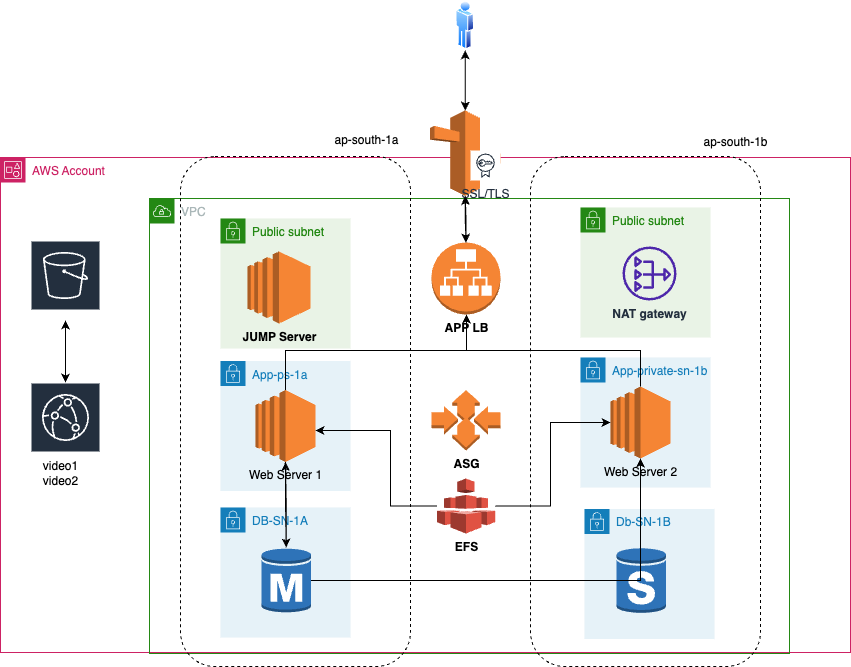

# 🏗️ AWS Scalable Web Application Architecture

This project demonstrates a secure, scalable, and modular AWS infrastructure using **Terraform** and **CloudFormation**. It follows a standard **three-tier architecture**, designed for high availability, security, and performance.

## 📌 Architecture Overview



### Key Components:
- **VPC** with public and private subnets across 2 Availability Zones
- **Jump Server (Bastion Host)** for secure SSH access
- **NAT Gateway** for internet access to private subnets
- **Web Servers** in private subnets
- **RDS MySQL** database (private)
- **S3** for static content storage
- **CloudFront** for global content delivery
- **Security Groups** to isolate each layer

---

## 🚀 Project Objectives

- Deploy infrastructure using **Infrastructure as Code (IaC)**
- Isolate workloads using network segmentation
- Enable secure and maintainable cloud environments
- Prepare for production-ready deployment environments

---

## 🛠️ Deployment Options

### 1. Terraform
You can find the Terraform files in the [`terraform/`](./terraform) directory.

#### Deploy using Terraform:
```bash
cd terraform
terraform init
terraform plan
terraform apply
